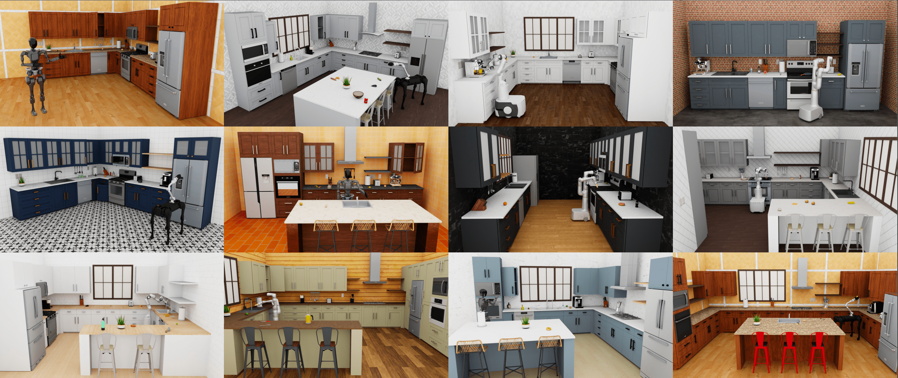

# RoboCasa: Large-Scale Simulation of Household Tasks for Generalist Robots
<!--  -->


This is the official RoboCasa codebase. Please refer to the accompanying [paper]() and [project website](https://robocasa.github.io/robocasa-web-dev/) for additional information.

-------
## Installation
Robocasa works across all major computing platforms, with or without GPU. Follow the instructions below to set up:
1. Set up conda environment:

   ```conda create -c conda-forge -n robocasa python=3.9```
3. Activate conda environment:

   ```conda activate robocasa```
5. Clone and setup robosuite dependency (**important: use the robocasa_v0.5 branch!**):

   ```git clone https://github.com/ARISE-Initiative/robosuite-dev -b robocasa_v0.5; cd robosuite-dev; pip install -e .```
7. Clone and setup this repo:

   ```git clone https://github.com/robocasa/robocasa; cd robocasa; source setup.sh```

-------
## Quick start
Run demo script: `python -m robocasa.demos.demo_kitchens`

**(Mac users: preprend the "python" command with "mj": `mjpython ...`)**

Please note the following:
- If using keyboard: ensure the MuJoCo window isn't the "active" window, otherwise the MuJoCo viewer keybindings will interfere. Press a background window (eg. desktop) and then proceed with pressing key strokes.
- If using spacemouse: you may need to modify the product id to your appropriate model, setting `SPACEMOUSE_PRODUCT_ID` in `robocasa/macros_private.py`

-------
## Key files
- `robocasa/demos/demo_kitchens.py`: interactive script to explore tasks and environments
- `robocasa/environments/kitchen/`: all implementations for kitchen tasks
  - `kitchen.py`: base class from which all kitchen tasks extend from
  - `single_stage/`: implementations of all single-stage tasks
  - `multi_stage/`: implementations of all multi-stage (aka "composite") tasks
- `robocasa/scripts/`: utility scripts
  - `collect_demos.py`: collect demonstration trajectories for any task and environment
  - `download_kitchen_assets.py`: downloads all assets. called automatically during setup in `setup.sh`
- `robocasa/models/assets/`: assets and implementations for objects and environment fixtures
  - `assets/objects/`: raw assets for all objects
  - `assets/fixtures/`: raw assets for all environment fixtures
  - `assets/kitchen_layouts/`: blueprints for kitchen layouts and designs
  - `objects/kitchen_objects.py`: registry for all object categories and groups
  - `objects/fixtures/`: implementations of all fixture classes
 
-------
## Citation
```
@inproceedings{robocasa2024,
  title={RoboCasa: Large-Scale Simulation of Household Tasks for Generalist Robots},
  author={Soroush Nasiriany and Abhiram Maddukuri and Lance Zhang and Adeet Parikh and Aaron Lo and Abhishek Joshi and Ajay Mandlekar and Yuke Zhu},
  booktitle={arXiv preprint arXiv:...},
  year={2024}
}
```
