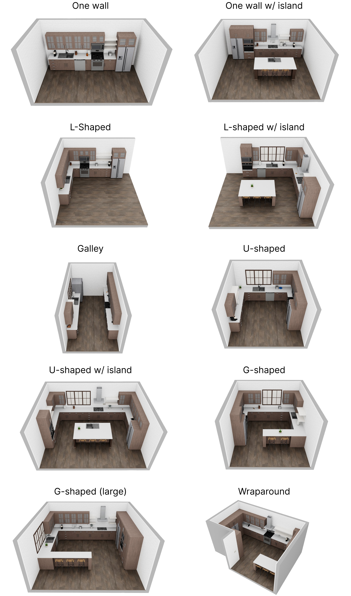
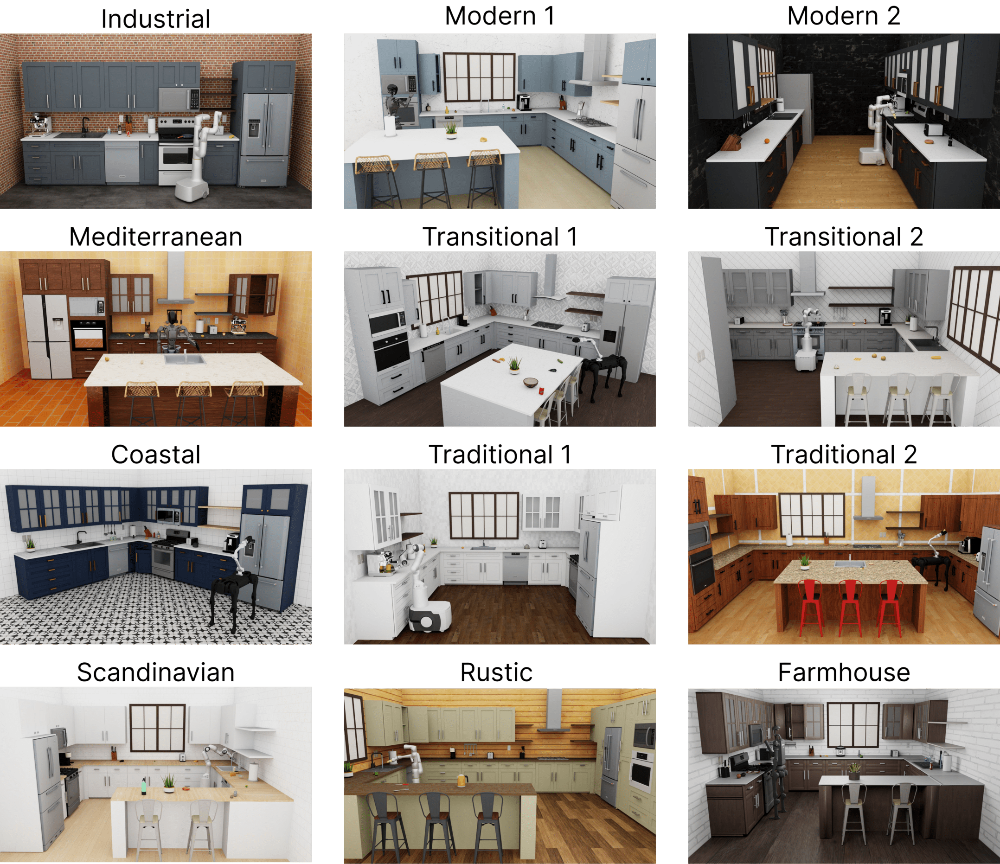

# Kitchen Scenes

RoboCasa offers a large array of kitchen scenes with fully interactive cabinets, drawers, and appliances.
We model 10 floor plans ranging from basic designs found in apartments to more elaborate designs found in high-end homes. Each floor plan can be configured to take on one of 12 unique styles, resulting in 120 kitchen scenes. See the breakdown of floor plans and styles as follows.

## Floor Plans

Floor plans are configured by setting the arrangment of fixtures (cabinets, microwaves, counters, etc.) in a yaml file. [**[Source]**](https://github.com/robocasa/robocasa/tree/main/robocasa/models/assets/kitchen_layouts)

## Styles

Styles are configured by setting relevant textures and fixture attributes (cabinet handle types, door types, coffee machine types, etc) in a yaml file. [**[Source]**](https://github.com/robocasa/robocasa/tree/main/robocasa/models/assets/kitchen_layouts/styles)

